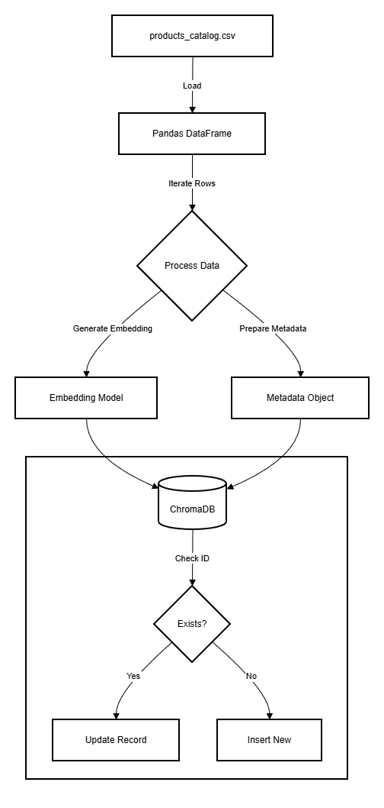
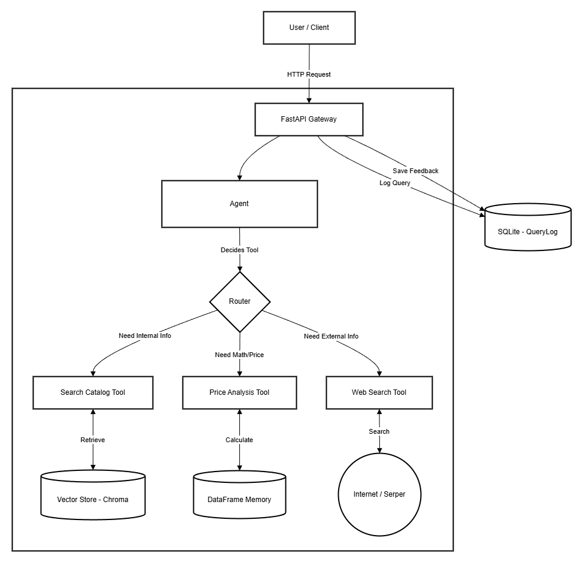

# System Architecture

## Overview
The AI Product Research Assistant is designed as a modular **Agentic RAG** system. It decouples the reasoning engine (LLM) from the knowledge base (Vector Store) and calculation logic (Tools).

## 1. Data Ingestion Pipeline

I support **Monthly Incremental Updates** using an "Upsert" strategy in Vector Database.

*Figure 1: Data Ingestion Pipeline Flow*

### Component Breakdown
1.  **products_catalog.csv**: The source of truth for product data (Raw Input).
2.  **Pandas DataFrame**: Loads data into memory for cleaning and preprocessing before ingestion.
3.  **Process Data**: Splits data into two streams:
    *   **Text Content**: Combinations of name, description, and brand for semantic understanding.
    *   **Metadata**: Structured fields (Price, ID, Rating) stored alongside embeddings.
4.  **Embedding Model**: Google Generative AI Embeddings model (`models/embedding-001`) that converts text content into vector representations.
5.  **Vector Store (ChromaDB)**: Stores the generated vectors and associated metadata for retrieval.
6.  **Update Logic (Upsert)**: The system checks `product_id`. If it exists, it updates the record; otherwise, it inserts a new one.

### Monthly Update Strategy
- **Unique Identifier**: I use `product_id` as the unique key in ChromaDB.
- **Upsert**: When `ingest_data()` runs, it calls `collection.upsert(ids=[...])`.
- **Benefit**: This ensures I don't duplicate products or need to drop the entire collection when a new CSV drops. Old products are updated, new ones are added.

## 2. System Architecture Diagram

*Figure 2: System Architecture & Request Flow*

### Component Breakdown
1.  **User / Client**: Sends HTTP requests (Queries or Feedback) to the system.
2.  **FastAPI Gateway**: The main entry point that handles API routing, request validation (Pydantic), and database session management.
3.  **Core Service (The Brain)**:
    *   **LangChain Agent**: The reasoning engine (powered by **Gemini 2.5 Flash**) that interprets user intent.
    *   **Router**: Internal logic that directs the query to the appropriate tool(s).
4.  **Tools & Data Sources**:
    *   **Search Catalog Tool**: Connects to **ChromaDB** for semantic search (finding products by description/similarity).
    *   **Price Analysis Tool**: Connects to **Pandas DataFrame** (In-Memory) for precise math, filtering, and sorting (e.g., "cheapest", "margin < 50%").
    *   **Web Search Tool**: Connects to the **Internet (Serper API)** for external market data (competitor prices, news).
5.  **Persistence Layer**:
    *   **SQLite (QueryLog)**: Stores transaction history (User Query + Agent Response) and Feedback for analytics.

## 3. Scaling Strategy

1. **Horizontal Scaling**: Deploy the application on **Scalable Cloud Services** (e.g., GCP Cloud Run) which automatically spins up more instances based on traffic load.
2. **Database Separation**: Currently, ChromaDB runs locally. For production, I would switch to a dedicated Vector DB Server (Client/Server mode) or a managed cloud service (ex. Pinecone) to handle millions of records.

## 4. Production Considerations

### Latency
- **Embedding & Retrieval**: Vector search is relatively fast (~200ms) but adds up in multi-step chains.
- **External APIs**: Web search (Serper) adds significant overhead (~1-2s) per call.
- **LLM Reasoning**: Using **Gemini 2.5 Flash** typically takes ~1-3s per call depending on input token size.
- **Total Expected Latency**: Average **~3-5 seconds** per query (handling internal data) and up to **8 seconds** for complex external research.

### Cost
- **LLM Engine**: Gemini 2.5 Flash ($0.30 per 1M input / $2.50 per 1M output).
- **External Search API**: Serper (~$0.001 per search).
- **Average Cost per Query**: **~$0.002 - $0.003 USD**.
- **Deployment Cost**: Excluded from this calculation.

### Security
- **API Keys**: Managed via `.env` / Secret Manager; no hardcoded credentials. In production, I would use a Secret Manager (e.g., GCP Secret Manager).
- **Basic Input Validation**: Pydantic models enforce strict data types (e.g., ensuring IDs are integers), effectively blocking malformed payloads or basic injection attempts.
- **Strict Prompt**: The System Prompt contains strict instructions to only answer relevant product questions and refuse off-topic queries to prevent hallucinations.

## 5. Trade-offs

- **In-Memory DataFrame**: I load the full CSV into Pandas memory for the `price_analysis_tool`.
    - *Pro*: Extremely fast calculations and filtering.
    - *Con*: Doesn't scale to millions of rows. For larger datasets, we would switch to **SQL based calculation** (text-to-sql).
- **Agentic Approach**: I chose a fully Agentic approach over a simple linear Chain.
    - *Pro*: Can handle complex, multi-step queries dynamically.
    - *Con*: More complexity and maybe higher latency.
- **Model Selection (Gemini 2.5 Flash)**: Chosen for its superior speed and low cost.
    - *Pro*: Response times are suitable for a real-time assistant.
    - *Con*: May lack the deep reasoning capabilities of larger models (e.g. Gemini 2.5 Pro). Switching to a "smarter" model would significantly increase latency and cost (Trade-off Latency + Cost for Intelligence).
